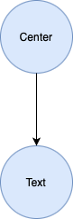

- [Widgets](#widgets)

# Widgets

In Flutter almost eveything is a widget.  You build your layout using widgets, so having a good understanding of how widgets work it is important.  Widgets are classes used tyo build your user interface.  You can compose single widgets to build more compplex ones.

The program below is a very minimal program in flutter that display "Hello Flutter!"  centered in the screen.  Let's analyze this program to understand how widgets work.

```dart
import 'package:flutter/material.dart';

void main() {
  runApp(
    Center(
      child: Text(
        'Hello Flutter!',
        textDirection: TextDirection.ltr,
      ),
    ),
  );
}
```

Below is the output you get when you run the program above.

<p align="center">
  
</p>

When you run this application, Flutter creates a widget tree.  The widget tree is a structure that represents how the widgets are organized.  If you are familiar with web programming, widget tree is similar to DOM.  In the example above, the widget tree consists of two widgets,  the root widget is the Center widget and its child, is the  Text widget.

<p align="center">
  
</p>